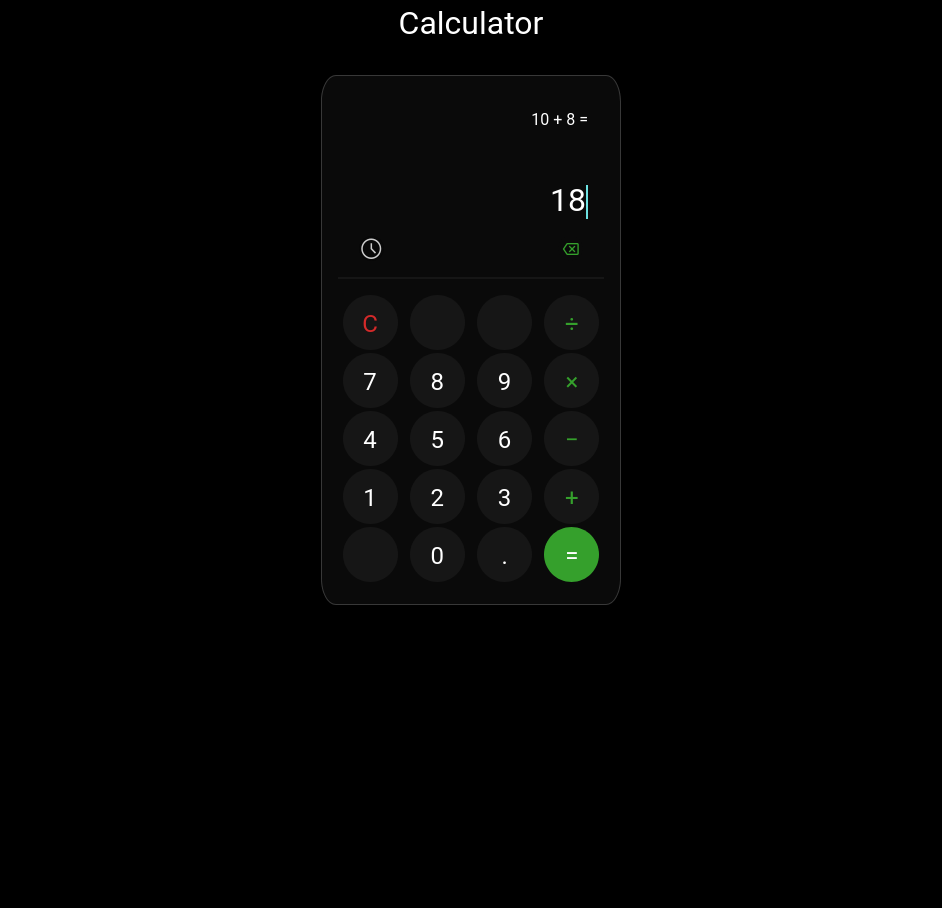

# Calculator

  </img>

This is my implementation of the [Calculator Project](https://www.theodinproject.com/lessons/foundations-calculator)
from the Java Script section of the Foundations course of [The Odin Project](https://www.theodinproject.com).

This project is made with HTML5, CSS3, and JS ES6 features.

The design was based on the calculator present in Samsung's smartphone.

## Functionality:
- Addition
- Subtraction
- Multiplication
- Division
- Floating point numbers
- History

## Skills Learned

- output HTML tag;
- CSS animations;
